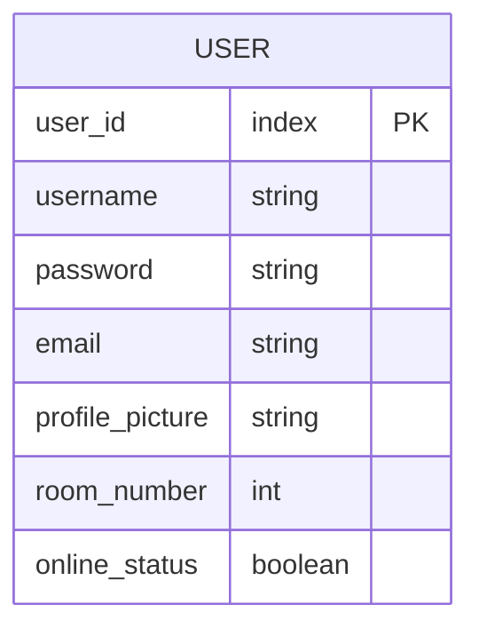

## 1. テーブル一覧

### 1.1. ユーザーテーブル

```mermaid
erDiagram
USER {
  user_id index   PK
  username string
  password string
  email    string
  profile_picture string
  room_number int 
  online_status boolean
}
```

### 1.2. メッセージテーブル

### 1.3. グループテーブル

### 1.4. ユーザーグループテーブル

### 1.5. ロケーションテーブル

## 2. ER図

