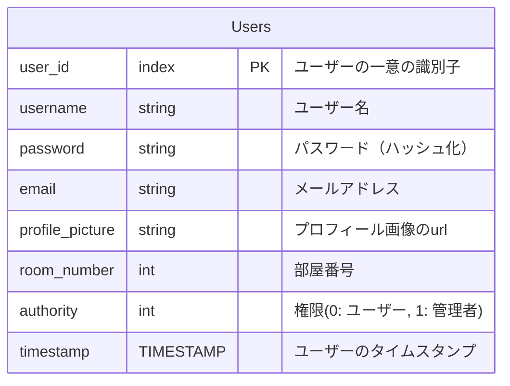
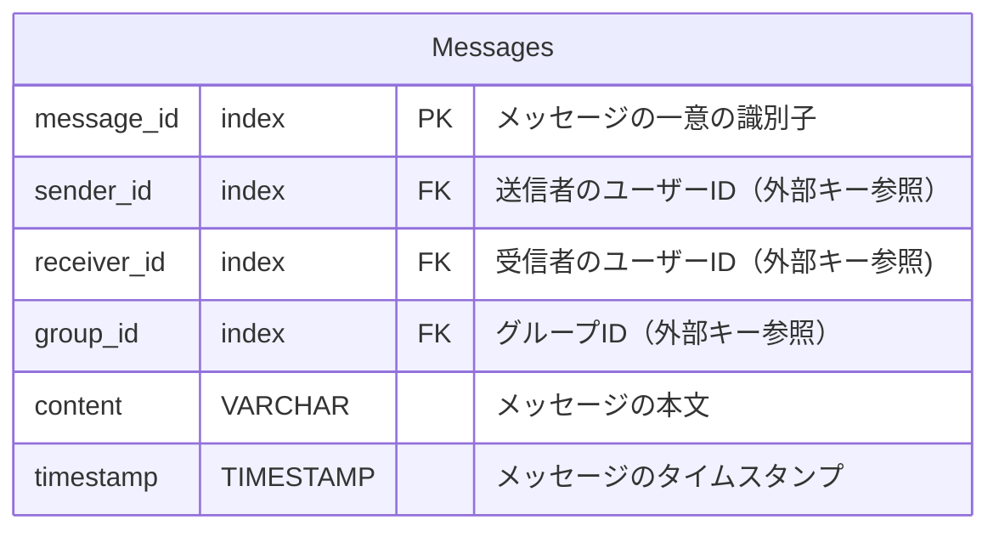
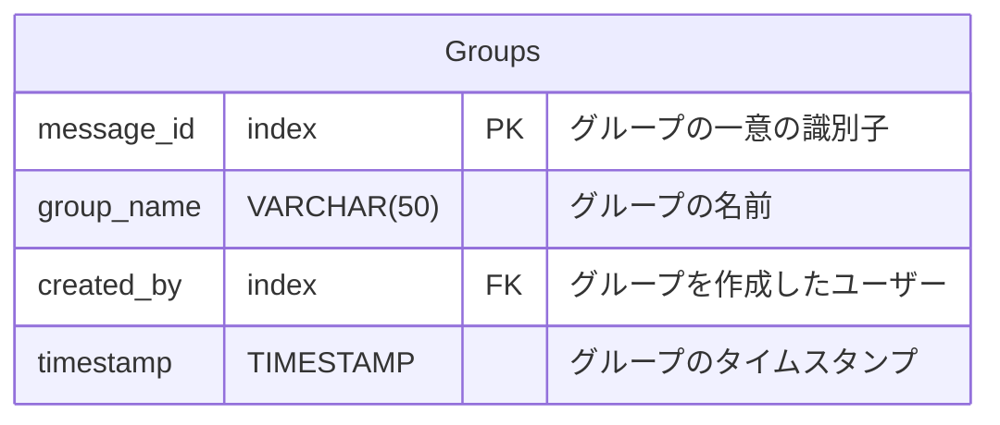
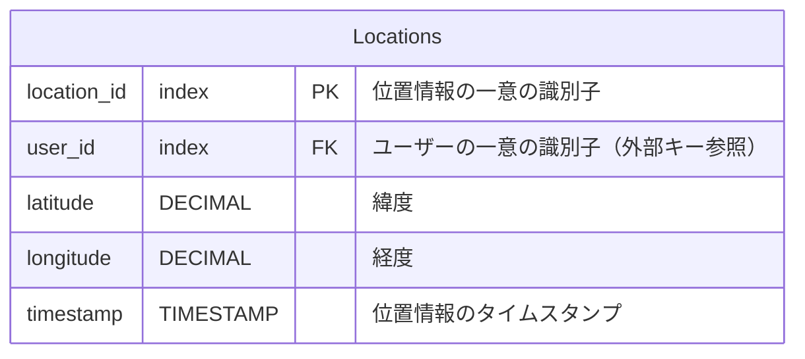
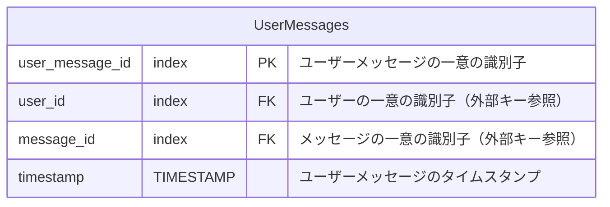
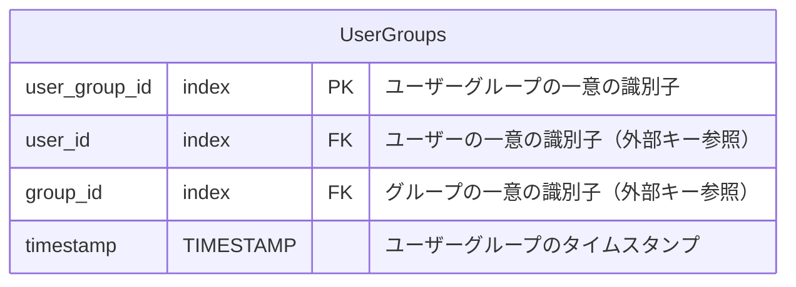
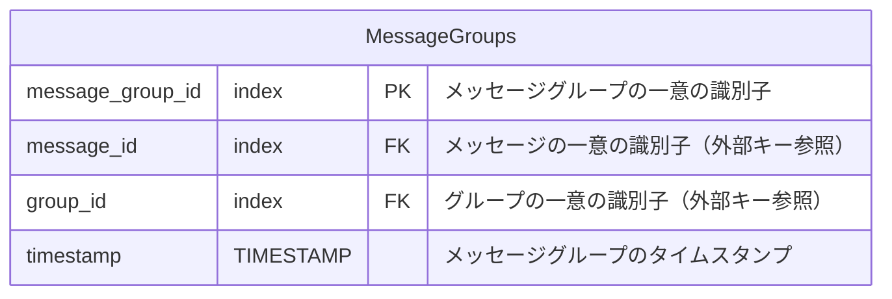
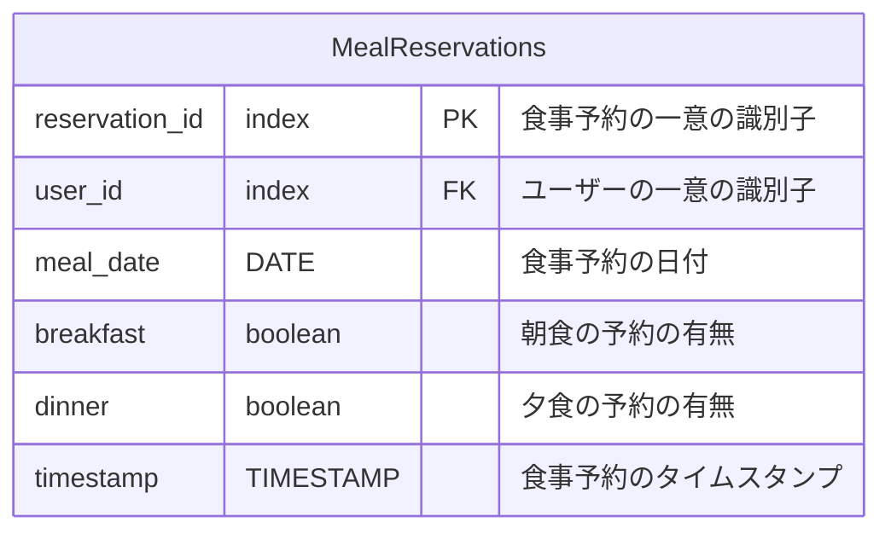
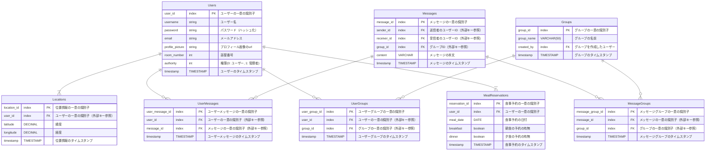

## 1. テーブル一覧

### 1.1. ユーザーテーブル

### 1.2. メッセージテーブル

### 1.3. グループテーブル

### 1.4. ロケーションテーブル

### 1.5. ユーザーメッセージテーブル

### 1.6. ユーザーグループテーブル

### 1.7. メッセージグループテーブル

### 1.8. 食事予約テーブル

## 2. ER図

